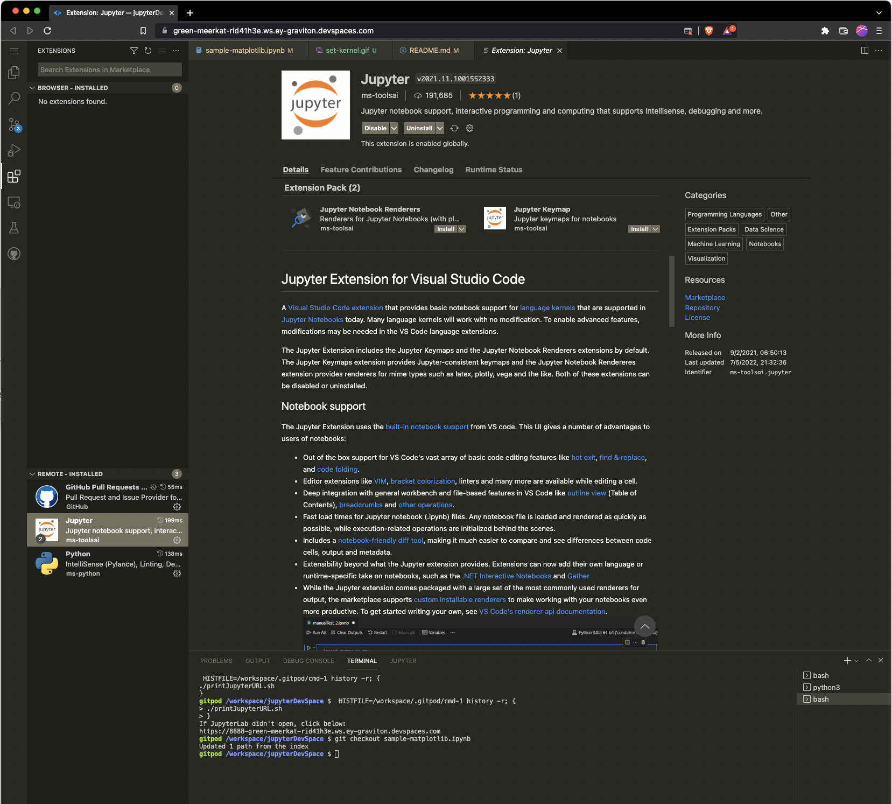
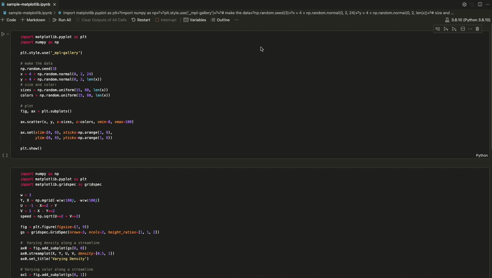

# Introduction

This repository contains a [Jupyter Lab installation](https://jupyter.org/).

This repository should start a Jupyter lab on its own, but if it does not,
click on the link as show in the script.

This will open up a new tab running Jupyter on your DevSpace.

# Using the Jupyter VSCode Extension

You can add the Jupyter VSCode Extension. See:

Make sure to set the kernel to the one in `~/.pyenv`.
That can be done as follows.

You can then work direc